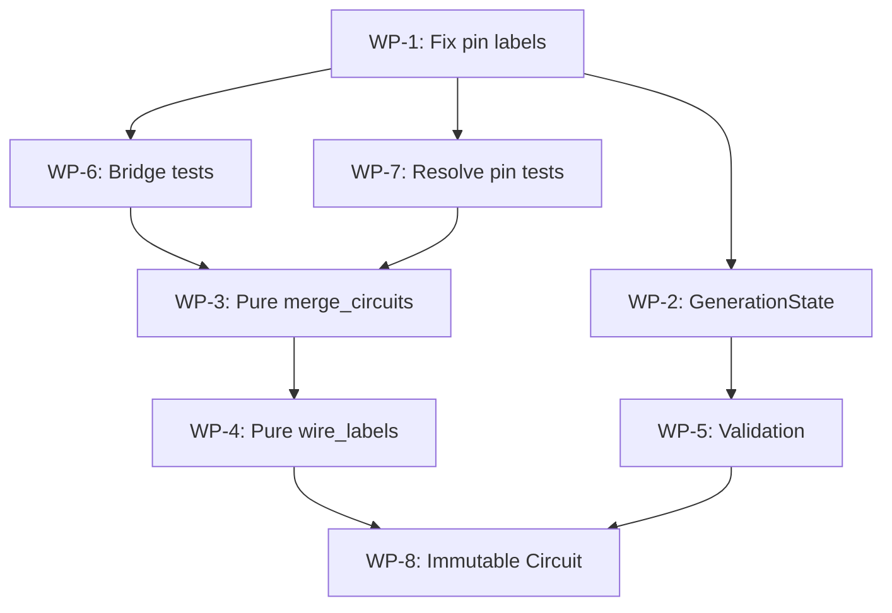

# Library Improvements & Roadmap

> **QC Review**: This document has been consolidated from the original `library_improvements.md` and `todo.md` files, with additional findings from a deep analysis of the entire `pyschemaelectrical` codebase.
>
> **Last Updated**: 2026-01-16 by agent review. Added verification tags, proposed solutions, project correspondences, and Typst migration plan.

---

## 1. Introduction

This document serves as a comprehensive analysis and roadmap for the `pyschemaelectrical` library. The goal is to evolve the library into a robust, type-safe, and logical foundation for electrical schematic generation, adhering to the "Pure Core, Imperative Shell" and "Data-Oriented Programming" philosophies as outlined in `GEMINI.md`.

### Document Conventions

- `[VERIFIED]` - Issue confirmed in source code with exact location
- `[NEEDS REVIEW]` - Issue may exist but not yet confirmed
- `[PROJECT IMPACT]` - Notes on how project code must change if library implements fix

---

## 2. Philosophy & Architecture

### 2.1 Current State (Positives)
- **Data-Oriented**: Core models (`Symbol`, `Point`, `Circuit`, `Port`, `Vector`) are correctly implemented as immutable dataclasses (`frozen=True`). This is a strong foundation.
- **Pure Core**: The generation logic (`_create_single_circuit_from_spec` in `builder.py`) is largely functional.
- **Imperative Shell**: `CircuitBuilder` acts as the mutable builder/shell, correctly separating concerns.
- **Functional State Threading**: The `state` dictionary (containing `tags`, `terminal_counters`, `contact_channels`, `terminal_registry`) is passed *into* and returned *from* functions, avoiding global mutable state.

### 2.2 Architectural Issues

| Issue | Location | Status | Description |
|---|---|---|---|
| **Leakage of Shell Concerns into Core** | `model/parts.py: three_pole_factory` | `[NEEDS REVIEW]` | Symbol factories make layout assumptions (translating by `pole_spacing`) that should ideally be handled by a layout engine or `CircuitBuilder`. Symbols should define *what* they are, not *where* they are relative to others. |
| **Circuit is Mutable** | `system/system.py:11` | `[VERIFIED]` | The `Circuit` dataclass is *not* frozen. Its `symbols` and `elements` lists are mutated in place by `add_symbol`, `auto_connect_circuit`, `merge_circuits`, and `add_wire_labels_to_circuit`. This violates the immutability principle. |
| **Mutation in Utility Functions** | `layout/wire_labels.py:240` | `[VERIFIED]` | `add_wire_labels_to_circuit` performs direct mutation via `circuit.elements.append(text_element)`. It should be a pure function returning a new circuit or elements list. |

### 2.3 Proposed Improvements

1. **Strict Separation**: Ensure `symbols` are purely data providers. Layout (stacking, translation) should be the sole responsibility of `CircuitBuilder` or future layout engines.

2. **Immutable `Circuit`**: Refactor `Circuit` to be `frozen=True`. All mutations should return a new `Circuit` instance.

   **Proposed Solution**:
   ```python
   @dataclass(frozen=True)
   class Circuit:
       symbols: Tuple[Symbol, ...] = ()
       elements: Tuple[Element, ...] = ()
       
       def with_elements(self, new_elements: Sequence[Element]) -> "Circuit":
           return replace(self, elements=tuple(self.elements) + tuple(new_elements))
   ```

   > [!WARNING]
   > **[PROJECT IMPACT]**: All project code using `merge_circuits(target, source)` would need to change to `target = merge_circuits(target, source)` (returns new Circuit instead of mutating).

3. **Pure Wire Labeling**: `add_wire_labels_to_circuit` should return `List[Element]` (the new labels) or a new `Circuit` with labels added.

   **Proposed Solution**:
   ```python
   def add_wire_labels_to_circuit(circuit, wire_labels, offset_x=-2.5) -> Circuit:
       # ... existing logic ...
       new_elements = list(circuit.elements) + label_elements
       return replace(circuit, elements=tuple(new_elements))
   ```

---

## 3. API & Usability (`CircuitBuilder`)

### 3.1 Current Issues

| Issue | Location | Severity | Status | Description |
|---|---|---|---|---|
| **Index-Based Connections** | `builder.py: add_connection` | High | `[VERIFIED]` | `builder.add_connection(idx_a, pole_a, idx_b, pole_b)` requires the user to manually track indices returned by `add_component`. This is fragile and error-prone. If a component is inserted or removed, all subsequent indices shift. |
| **Ambiguous Pin Resolution** | `builder.py:455` | High | `[VERIFIED]` | The function relies on heuristics like `len(pins) == poles * 2` to determine whether to use interleaved or direct indexing. This is non-deterministic and difficult to debug when it fails. |
| **Broken Fluent Pattern** | `builder.py: add_component/add_terminal` | Medium | `[VERIFIED]` | These methods return `(self, index)`, forcing the user to break the chain to store the index. This prevents clean `builder.add(...).add(...).build()` chaining. |

### 3.2 Recommendations

1. **Tag-Based Connections**: References components by their **Logical Name** or **Tag**.
   ```python
   builder.add_component(..., logical_name="BREAKER_1")
   builder.connect("BREAKER_1", "L1", "MOTOR_1", "U")
   ```

2. **`ComponentRef` Return Object**: `add_component` should return a `ComponentRef` object (containing UUID/Tag and a reference to the builder) that can be used for connections, rather than an integer index.
   ```python
   @dataclass
   class ComponentRef:
       builder: 'CircuitBuilder'
       index: int
       tag: str

       def pin(self, pin_name: str) -> 'PortRef':
           return PortRef(self, pin_name)

   # Usage
   m1 = builder.add(Motor, ...)
   k1 = builder.add(Contactor, ...)
   builder.connect(m1.pin("U"), k1.pin("2"))
   ```
   This restores the imperative fluent chain while keeping the underlying index-based engine temporarily.

   > [!IMPORTANT]
   > **[PROJECT IMPACT]**: All project files using `_, idx = builder.add_component(...)` would change to `ref = builder.add_component(...)`. The `valves.py` pattern `terminal_indices.append(t_idx)` would become `terminal_refs.append(ref)`.

3. **Explicit Port IDs**: Deprecate "Pole Index" based connections. Connect specific *Port IDs* (e.g., "L", "13", "A1") to *Port IDs*.

---

## 4. Type Safety & Error Handling

### 4.1 Current Issues

| Issue | Location | Severity | Status | Description |
|---|---|---|---|---|
| **Loose `state` Typing** | Multiple (`builder.py`, `autonumbering.py`, `utils.py`) | High | `[VERIFIED]` | Widespread use of `Dict[str, Any]` for `state`. This prevents IDE autocompletion and type checking. |
| **Runtime Errors** | `builder.py: _create_single_circuit_from_spec` | Medium | `[VERIFIED]` | Connection errors often manifest as `KeyError` or silent failures (missing lines) during rendering, rather than strict validation errors at build time. |
| **Fragile String Constants** | Symbols, `connection_registry.py` | Low | `[VERIFIED]` | Pin names are strings (e.g., "24V", "1"). Mismatches are easy and only surface at runtime. |

### 4.2 Recommendations

1. **Typed State Dataclass**: Replace `Dict[str, Any]` state with a structured `GenerationState` dataclass.
   ```python
   @dataclass
   class GenerationState:
       tags: Dict[str, int] = field(default_factory=dict)
       terminal_counters: Dict[str, int] = field(default_factory=dict)
       contact_channels: Dict[str, int] = field(default_factory=dict)
       terminal_registry: TerminalRegistry = field(default_factory=TerminalRegistry)
   ```
   This also opens the door to frozen state variants for caching.

   > [!NOTE]
   > **[PROJECT IMPACT]**: Minimal. Project code passes `state` opaquely; internal structure change is transparent if API is preserved.

2. **Validation Layer in `build()`**: The `CircuitBuilder.build()` method should perform a complete graph validation pass *before* attempting layout:
   - Verify all referenced components exist.
   - Verify all referenced ports exist on those components.
   - Check for simplified electrical rules (e.g., output-to-output shorts).
   - Raise `CircuitValidationError` with a clear message.

3. **Literal Types**: Use `Literal["top", "bottom", "left", "right"]` for side definitions instead of plain strings.
   ```python
   PortSide = Literal["top", "bottom", "left", "right"]
   ```

---

## 5. Symbols & Factories

### 5.1 Current Issues

| Issue | Location | Severity | Status | Description |
|---|---|---|---|---|
| **Alphabetical Port Sorting in `create_pin_labels`** | `model/parts.py:143` | Medium | `[VERIFIED]` | Code: `p_keys = sorted(ports.keys())`. This sorts port keys alphabetically, disregarding the user's intended pin order (e.g., "A1", "A2" would sort before "L", "N", "PE"). |
| **Rigid Port Remapping in `three_pole_factory`** | `model/parts.py:227-229` | Low | `[NEEDS REVIEW]` | Multi-pole factories forcibly add ports "1".."6". While now using fixed IDs regardless of pin labels, the original semantic port names (like "L1_in", "L1_out") are not preserved as aliases. |
| **Dynamic Block Verbose Boilerplate** | Consumer code (e.g., `valves.py`) | Medium | `[VERIFIED]` | While `dynamic_block_symbol` supports explicit positioning via `top_pin_positions`, consuming code is forced to manually calculate these arrays, leading to verbose boilerplate. |

### 5.2 Recommendations

1. **Ordered Ports (or Insertion-Order Dicts)**: `Symbol.ports` should store ports in an `OrderedDict` or rely on Python 3.7+'s insertion-ordered `dict` for labeling. `create_pin_labels` should iterate through the `pins` tuple provided by the user and look up ports, *not* sort keys.

   **Proposed Fix** at `model/parts.py:143`:
   ```python
   # BEFORE (BAD - alphabetical):
   p_keys = sorted(ports.keys())
   
   # AFTER (Good - insertion order from symbol factory):
   p_keys = list(ports.keys())
   ```

   > [!NOTE]
   > **[PROJECT IMPACT]**: None expected. This is a correctness fix that makes pin labels match user expectations.

2. **Preserve Port Semantics**: Multi-pole factories should allow retaining original port IDs with a suffix (e.g., "L_1", "L_2") or use a strictly documented mapping strategy. Consider adding semantic aliases:
   ```python
   ports["L1_top"] = replace(ports["1"], id="L1_top")
   ```

3. **Smart Dynamic Blocks (Future Enhancement)**:
   - Input: `inputs=["24V", "0V"]`, `outputs=["L1", "N"]`
   - Auto-layout: The block should calculate its own width and pin positions based on simple "spacing" and "margin" rules, without requiring explicit coordinate arrays from the user.

---

## 6. Layout & Connections

### 6.1 Current Issues

| Issue | Location | Severity | Status | Description |
|---|---|---|---|---|
| **Purely Geometric Auto-Connect** | `layout/layout.py: auto_connect`, `_find_matching_ports` | High | `[VERIFIED]` | Logic is purely **Geometric**. It finds "Down" ports on Top symbol and "Up" ports on Bottom symbol, and connects them if their X-coordinates match within 0.1mm. This is fragile (slight misalignments break connections) and "blind" (connects anything that aligns, regardless of electrical validity). |
| **Manual Layout Calculation** | Consumer code (e.g., `valves.py`) | Medium | `[VERIFIED]` | User scripts are forced to manually calculate `group_base_x`, `terminal_step_x`, `block_y_offset` to achieve custom layouts (e.g., "staggered" connections). |

### 6.2 Wire Labeling Logic

| Issue | Location | Severity | Status | Description |
|---|---|---|---|---|
| **Index-Based Wire Labeling** | `layout/wire_labels.py` | High | `[VERIFIED]` | Wire labeling is **Index-Based**. It finds all vertical lines in the final circuit and applies labels from a list *in the order the lines were created/added*. If the build order changes (e.g., drawing right-to-left instead of left-to-right), wire labels will be applied to the wrong wires. There is no verification that the "RD" label is actually on a "Live" wire. |
| **X-Coordinate Sorting in `auto_connect_labeled`** | `layout/layout.py: _find_matching_ports` | Medium | `[NEEDS REVIEW]` | Sorts ports by X-coordinate. If the geometry shifts slightly, the sorted order might change, causing label mismatches. |

### 6.3 Recommendations

1. **Graph-Aware Auto-Connect**: `CircuitBuilder` should maintain a logical **Netlist**. `auto_connect` should only draw lines for *logically* connected ports. The current geometric fallback can be kept for simple "stacking" (like terminal blocks), but prefer explicit connections registered via `add_connection` or netlist.

2. **Topological Wire Labeling**: Wire properties (color, cross-section) should be attributes of the **Connection/Net** object in `CircuitBuilder`, not a post-process of geometry.
   - The renderer should look at the `Connection` object to decide what label to draw next to the line, rather than finding all vertical lines and applying a list.

3. **Grid System & Layout Containers (Future)**:
   - Introduce a formal Grid system. `width=5` should mean 5 grid units, not "5 * GRID_SIZE calculated manually".
   - Layout Containers: `RowLayout`, `ColumnLayout`, `StaggeredLayout` (for the valve terminal stairs). The user should define *structure*, the library should calculate *coordinates*.

   ```python
   # Concept
   layout.chain(
       components=[t1, t2, t3, t4, t5],
       pattern="diagonal", 
       step=(10, 10)
   ).connect_to(shared_block)
   ```

---

## 7. Code Cleanup & Deduplication

> Consolidated from `todo.md`.

### 7.1 Duplicate Functionality

| Item | Location(s) | Status | Description |
|---|---|---|---|
| `next_contact_pins` | `utils/utils.py:37` | `[ ] CHECK` | This function generates SPDT contact pins ("X1", "X2", "X4"). Verify it is not duplicated elsewhere (e.g., in `lib_func` or `autonumbering.py` logic). Ensure only one source of truth is used. |
| Terminal Bridge Migration | `utils/terminal_bridges.py` | `[x] DONE` | Migrated terminal bridge utilities from `auxillary_cabinet_v3` project to the library. Functions now accept `internal_connections` dict as a parameter for flexibility. |

### 7.2 Mutation Concerns

| Item | Location | Status | Recommendation |
|---|---|---|---|
| `add_wire_labels_to_circuit` | `layout/wire_labels.py:240` | `[VERIFIED] [ ] TODO` | Performs direct mutation of `circuit.elements`. Should be a pure function returning a new list of elements to align with `PySchemaElectrical`'s functional style. |
| `merge_circuits` | `system/system.py:104-105` | `[VERIFIED] [ ] TODO` | Mutates `target.symbols` and `target.elements`. Should return a new `Circuit` object. |

---

## 8. Testing

### 8.1 Current State

| Area | Status | Notes |
|---|---|---|
| Unit Tests (Core) | ✅ OK | `test_model_core.py`, `test_primitives.py`, `test_parts.py` |
| Unit Tests (Builder) | 🟡 Basic | `test_builder.py` exists but has minimal coverage (3 tests). Does not test `_resolve_pin` edge cases. |
| Unit Tests (Wire Labels) | ✅ OK | `test_wire_labels.py` has good coverage of utility functions. |
| Integration Tests | 🟠 Minimal | Only `tests/integration/` directory with a single file. |
| Snapshot/Regression Tests | ⚪ NONE | No tests to ensure PDF/SVG output remains identical after refactoring. |
| Tests for `terminal_bridges.py` | ⚪ NONE | No tests for the newly migrated module. |

### 8.2 Action Items

- [ ] Improve coverage and quality for `wire_labels.py` and `system.py` additions.
- [ ] Add regression tests to ensure PDF output remains identical after migration.
- [ ] Add tests for `terminal_bridges.py` module.
- [ ] Add tests for `_resolve_pin` edge cases (varying `pins` lengths, terminal vs symbol).
- [ ] Add tests for `CircuitBuilder.add_connection` with various component types.

---

## 9. Documentation

### 9.1 Current State

| Document | Status | Notes |
|---|---|---|
| `README.md` | ✅ Good | Comprehensive overview of library. |
| `pyschemaelectrical_API_guide.md` | ✅ Good | Detailed deep-dive for LLM Agents. |
| `docs/NAMING_CONVENTION.md` | ✅ Good | Clear terminal/pin naming conventions. |
| `docs/guides/PIN_CONFIGURATION.md` | ✅ Good | Explains 3 patterns for pin configuration. |
| `examples/` | ✅ Good | Many examples covering most features. |

### 9.2 Action Items

- [ ] Verify that all new functions have comprehensive docstrings (mostly done during migration).
- [ ] Add examples of using `merge_circuits` and `add_wire_labels_to_circuit` to the `examples/` directory.
- [ ] Add example for using `update_csv_with_internal_connections` to the `examples/` directory.
- [ ] Document `ComponentRef` pattern once implemented.

---

## 10. Immediate Action Items (Priority Order)

| Priority | Item | Effort | Impact | Status |
|---|---|---|---|---|
| **P0** | Fix `create_pin_labels` to stop sorting keys. | Low | Medium (Correctness) | `[VERIFIED]` Ready to implement |
| **P0** | Fix `_resolve_pin` to use explicit port ID mapping instead of length heuristics. | Medium | High (Correctness) | `[VERIFIED]` Needs design |
| **P1** | Add `GenerationState` TypedDict or dataclass for the state dictionary. | Medium | High (Type Safety, DX) | |
| **P1** | Add validation layer in `CircuitBuilder.build()`. | Medium | High (Developer Experience) | |
| **P2** | Refactor `add_wire_labels_to_circuit` and `merge_circuits` to be pure. | Medium | Medium (Philosophical Alignment) | `[VERIFIED]` |
| **P2** | Add tests for `terminal_bridges.py`. | Low | Medium (Stability) | |
| **P3** | Implement `ComponentRef` pattern for fluent connections. | High | High (Usability) | |
| **P3** | Design and implement Layout Containers (future). | High | High (Usability) | |

---

## 11. Open Questions

1. **Should `Circuit` be frozen?**
   - Pros: Aligns with immutability philosophy, enables caching, thread-safe.
   - Cons: Requires significant refactoring. All `append` calls become `+ [new_element]` which creates new lists.
   - **Decision needed**: Discuss trade-offs. A frozen `Circuit` is ideal but may be impractical for incremental builds.
   - **Developer choice**: Implement frozen `Circuit`

2. **How to handle geometric vs topological connections?**
   - Currently, `auto_connect` is purely geometric.
   - Should `CircuitBuilder` maintain an explicit netlist/graph?
   - **Recommendation**: Add an optional graph (e.g., using `networkx` or a simple adjacency list) for validation and labeling, but keep geometric auto-connect for simple stacking.
   - **Developer choice**: this needs more invenstigation, proposed solutions and trade-offs and what needs to be done to support it.

3. **Pin Resolution Strategy**
   - The current `_resolve_pin` has unclear semantics for symbols with named ports (e.g., PSU with "L", "N", "PE", "24V", "GND").
   - **Recommendation**: Symbols with named ports should require explicit pin specification or use a documented port order (not alphabetical). Consider adding a `port_order` attribute to `Symbol`.
   - **Developer choice**: This sounds smart, but we need to invetigate a good solution and what needs to be done to support it.
---

## 12. Project Correspondence Table

This section documents how `auxillary_cabinet_v3` project code must change when the library implements proposed improvements.

### If `ComponentRef` is Implemented (P3)

| Project File | Current Pattern | New Pattern |
|---|---|---|
| `valves.py` | `_, t_idx = builder.add_terminal(...)` | `t_ref = builder.add_terminal(...)` |
| `valves.py` | `terminal_indices.append(t_idx)` | `terminal_refs.append(t_ref)` |
| `valves.py` | `builder.add_connection(terminal_indices[k], 0, ...)` | `builder.connect(terminal_refs[k].pin("bottom"), ...)` |
| All circuit files | `_, idx = builder.add_component(...)` | `ref = builder.add_component(...)` |

### If `Circuit` Becomes Immutable (P2)

| Project File | Current Pattern | New Pattern |
|---|---|---|
| `main.py` via `valves.py` | `merge_circuits(final_circuit, res.circuit)` | `final_circuit = merge_circuits(final_circuit, res.circuit)` |
| Any wire labeling | `add_wire_labels_to_circuit(circuit, labels)` | `circuit = add_wire_labels_to_circuit(circuit, labels)` |

### If `GenerationState` Dataclass is Implemented (P1)

| Project File | Impact |
|---|---|
| All | **None** - State is passed opaquely, internal structure transparent to project |

---

## 13. Typst Compiler & Template Migration Plan

### 13.1 Overview

Migrate the Typst PDF compilation infrastructure from `auxillary_cabinet_v3` to `pyschemaelectrical` as a core rendering module. SVG and CSV exports remain optional utilities, that can be exported from the library as files into a choosen folder, just as today. but normally, these temporary files are deleted after the PDF is generated.

### 13.2 Current Project Structure

```
auxillary_cabinet_v3/
└── src/
    └── typst_generation/
        ├── compiler.py          # PDF compilation logic
        ├── template.typ         # Typst template
        ├── generate_A3_frame.py # Frame SVG generator
        ├── A3_frame.svg         # Generated frame
        └── Zen LOGO SMUSS.png   # Project-specific logo
```

### 13.3 Proposed Library Structure

```
pyschemaelectrical/
└── rendering/
    ├── __init__.py
    ├── typst/
    │   ├── __init__.py          # Exports: TypstCompiler, A3Template, TypstConfig
    │   ├── compiler.py          # Core compilation logic
    │   ├── templates/
    │   │   ├── a3_drawing.typ   # Base A3 template
    │   │   └── A3_frame.py      # A3 frame generator
    │   └── config.py            # TypstConfig dataclass
    └── svg.py                   # Optional SVG utilities (existing renderer.py)
```

### 13.4 What Moves to Library (Generic)

| Component | Description |
|---|---|
| `A3Template` class | Typst template generator with configurable parameters |
| `TypstCompiler` class | PDF compilation with customizable content injection |
| `TypstConfig` dataclass | Configurable: margins, fonts, title block dimensions |
| `A3FrameGenerator` | Frame SVG with A-F rows, 1-8 columns |
| `schematic()` function | Typst helper for placing SVG schematics |
| `terminal_table()` function | Typst helper for terminal tables |

### 13.5 What Stays in Project (Specific)

| Component | Description |
|---|---|
| Logo image | `Zen LOGO SMUSS.png` |
| `get_front_page_content()` | Parses project-specific `front_page.md` |
| `TERMINAL_DESCRIPTIONS` | Project-specific terminal descriptions |
| PLC report format | Project-specific column structure |
| Terminal report format | Project-specific bridge visualization |

### 13.6 Proposed API

```python
from pyschemaelectrical.rendering.typst import TypstCompiler, TypstConfig, A3Template

# Configure template
config = TypstConfig(
    logo_path="src/assets/my_logo.png",
    project_name="Zen Battery",
    drawing_number="AUX-001",
    author="OJB",
    revision="00",
    font_family="Times New Roman", # This should be configurable and affect all text in the document and circuits.
)

# Create compiler with template
compiler = TypstCompiler(
    template=A3Template(config),
    output_path="output.pdf"
)

# Add pages
for page in schematic_pages:
    compiler.add_schematic_page(
        svg_path=page.svg_path,
        title=page.title,
        terminals_csv=page.terminals_path
    )

# Add custom content (project-specific reports)
compiler.add_custom_typst(front_page_typst)
compiler.add_custom_typst(plc_report_typst)

# Compile
compiler.compile()
```

### 13.7 Refactored Project Usage

After migration, `auxillary_cabinet_v3/src/typst_generation/compiler.py` becomes:

```python
from pyschemaelectrical.rendering.typst import TypstCompiler, TypstConfig, A3Template
from python.constants import TERMINAL_DESCRIPTIONS

def compile_pdf(drawing_name, drawing_number, author, project, revision, output_path, pages):
    config = TypstConfig(
        logo_path="src/typst_generation/Zen LOGO SMUSS.png",
        project_name=project,
        drawing_number=drawing_number,
        author=author,
        revision=revision,
    )
    
    compiler = TypstCompiler(A3Template(config), output_path)
    
    # Project-specific: Front page
    compiler.add_custom_typst(get_front_page_content())
    
    # Schematic pages
    for page in pages:
        compiler.add_schematic_page(
            svg_path=page["schematic_path"],
            title=page["title"],
            terminals_csv=page["terminals_path"]
        )
    
    # Project-specific: Reports
    compiler.add_custom_typst(get_plc_report_typst())
    compiler.add_custom_typst(get_terminal_report_typst(TERMINAL_DESCRIPTIONS))
    
    compiler.compile()
```

### 13.8 Migration Steps

1. **Phase 1**: Create `pyschemaelectrical/rendering/typst/` module structure
2. **Phase 2**: Extract generic template and compilation logic
3. **Phase 3**: Create `TypstConfig` dataclass and `A3Template` class
4. **Phase 4**: Move frame generator to library
5. **Phase 5**: Refactor project's `compiler.py` to use library module
6. **Phase 6**: Add tests for Typst rendering

---

## 14. Work Packages

> **Purpose**: This chapter defines atomic, self-contained work packages that can be executed independently. Each package ensures the library remains functional after completion, with all tests passing, examples working, and PDF output preserved.

> [!IMPORTANT]
> **Execution Order**: Work packages are ordered by priority (P0 first). However, packages at the same priority level (e.g., WP-1 and WP-2) can be executed in any order. Always run all tests after completing a package.

---

### WP-1: Fix Alphabetical Port Sorting in `create_pin_labels`

**Priority**: P0 (Immediate)  
**Effort**: Low  
**Impact**: Medium (Correctness)  
**Status**: Ready to implement

#### Problem Statement
The `create_pin_labels` function at `model/parts.py:143` sorts port keys alphabetically using `sorted(ports.keys())`. This disregards the user's intended pin order—for example, ports "A1", "A2" would sort before "L", "N", "PE" regardless of their creation order.

#### Scope

| What Changes | What Stays the Same |
|---|---|
| `create_pin_labels` function | All symbol factories |
| Pin label ordering | Port creation logic |
| | All other functions in `parts.py` |

#### Code Changes

##### [MODIFY] [parts.py](file:///c:/Users/OleJohanBondahl/Documents/GitHub_ZEN/PySchemaElectrical/src/pyschemaelectrical/model/parts.py)

**Location**: Line 143

```diff
-    p_keys = sorted(ports.keys())
+    # Use insertion order (Python 3.7+ dict ordering) instead of alphabetical
+    p_keys = list(ports.keys())
```

#### Affected Library Files

| File | Impact |
|---|---|
| `model/parts.py` | Direct change |
| `symbols/*.py` | No change needed - insertion order preserved |
| `builder.py` | No change needed |

#### Affected Project Files

| File | Impact |
|---|---|
| None | This is a correctness fix that makes pin labels match user expectations |

#### Testing

##### Unit Tests

| Test | Command | Expected Result |
|---|---|---|
| `test_parts.py` | `pytest tests/unit/test_parts.py -v` | All existing tests pass |

##### New Test to Add

Add to `tests/unit/test_parts.py`:

```python
def test_create_pin_labels_preserves_insertion_order():
    """Pin labels should follow port insertion order, not alphabetical order."""
    from pyschemaelectrical.model.core import Port, Point, Vector
    
    # Create ports in a specific non-alphabetical order
    ports = {
        "L": Port(id="L", position=Point(0, 0), direction=Vector(0, -1)),
        "A1": Port(id="A1", position=Point(10, 0), direction=Vector(0, -1)),
        "N": Port(id="N", position=Point(20, 0), direction=Vector(0, -1)),
    }
    
    labels = create_pin_labels(ports, ("LIVE", "AUX", "NEUTRAL"))
    
    # Labels should be in insertion order: L, A1, N
    label_texts = [lbl.content for lbl in labels]
    assert label_texts == ["LIVE", "AUX", "NEUTRAL"]
```

##### Example Verification

| Example | Command | Verify |
|---|---|---|
| `example_pin_configurations.py` | `python examples/example_pin_configurations.py` | Compare output SVG - pin labels should appear in consistent order |

##### Manual Verification
1. Run `python examples/example_psu.py`
2. Inspect the output SVG for the PSU symbol
3. Confirm that pin labels (L, N, PE, 24V, GND) appear in the expected order, not alphabetically

#### Documentation Updates

| Document | Update |
|---|---|
| `model/parts.py` docstring | Add note: "Labels are assigned in port insertion order" |
| No other docs require updates | - |

#### Completion Checklist

- [ ] Modify `create_pin_labels` to use insertion order
- [ ] Add new unit test
- [ ] Run `pytest tests/unit/test_parts.py -v` - all pass
- [ ] Run `pytest tests/ -v` - all pass
- [ ] Run `example_pin_configurations.py` - output unchanged or improved
- [ ] Run `example_psu.py` - output unchanged
- [ ] Update docstring

---

### WP-2: Typed State Dataclass (`GenerationState`)

**Priority**: P1  
**Effort**: Medium  
**Impact**: High (Type Safety, Developer Experience)  
**Status**: Ready to implement

#### Problem Statement
Widespread use of `Dict[str, Any]` for the `state` dictionary prevents IDE autocompletion, type checking, and makes the codebase harder to understand and maintain.

#### Scope

| What Changes | What Stays the Same |
|---|---|
| State structure (internal) | API signatures (external) |
| Type annotations | Function behavior |
| IDE support | Project code |

#### Code Changes

##### [NEW] [state.py](file:///c:/Users/OleJohanBondahl/Documents/GitHub_ZEN/PySchemaElectrical/src/pyschemaelectrical/model/state.py)

```python
"""
Typed state for circuit generation.

Provides type-safe state management for the CircuitBuilder and
related generation functions.
"""
from dataclasses import dataclass, field
from typing import Dict


@dataclass
class GenerationState:
    """
    Immutable state container for circuit generation.
    
    Attributes:
        tags: Counter for component tags (e.g., {"K": 3} means next K is K4)
        terminal_counters: Counter for terminal numbering per terminal block
        contact_channels: Counter for contact channel assignment
        terminal_registry: Registry of terminal connections
    """
    tags: Dict[str, int] = field(default_factory=dict)
    terminal_counters: Dict[str, int] = field(default_factory=dict)
    contact_channels: Dict[str, int] = field(default_factory=dict)
    terminal_registry: Dict[str, list] = field(default_factory=dict)
    
    def to_dict(self) -> Dict:
        """Convert to dictionary for backward compatibility."""
        return {
            "tags": self.tags.copy(),
            "terminal_counters": self.terminal_counters.copy(),
            "contact_channels": self.contact_channels.copy(),
            "terminal_registry": self.terminal_registry.copy(),
        }
    
    @classmethod
    def from_dict(cls, d: Dict) -> "GenerationState":
        """Create from dictionary for backward compatibility."""
        return cls(
            tags=d.get("tags", {}).copy(),
            terminal_counters=d.get("terminal_counters", {}).copy(),
            contact_channels=d.get("contact_channels", {}).copy(),
            terminal_registry=d.get("terminal_registry", {}).copy(),
        )


def create_initial_state() -> Dict:
    """
    Create a new initial state dictionary.
    
    Returns:
        Dict: A fresh state with all required keys initialized.
    """
    return GenerationState().to_dict()
```

##### [MODIFY] [autonumbering.py](file:///c:/Users/OleJohanBondahl/Documents/GitHub_ZEN/PySchemaElectrical/src/pyschemaelectrical/utils/autonumbering.py)

- Add type hints using `Union[Dict[str, Any], GenerationState]`
- Add optional `create_initial_state()` usage

##### [MODIFY] [utils.py](file:///c:/Users/OleJohanBondahl/Documents/GitHub_ZEN/PySchemaElectrical/src/pyschemaelectrical/utils/utils.py)

- Add type hints for state parameter

##### [MODIFY] [__init__.py](file:///c:/Users/OleJohanBondahl/Documents/GitHub_ZEN/PySchemaElectrical/src/pyschemaelectrical/__init__.py)

- Export `create_initial_state` from the model module

#### Affected Library Files

| File | Impact | Change Type |
|---|---|---|
| `model/state.py` | New file | Create |
| `utils/autonumbering.py` | Type hints | Modify |
| `utils/utils.py` | Type hints | Modify |
| `builder.py` | Type hints (optional) | Modify |
| `__init__.py` | Export | Modify |

#### Affected Project Files

| File | Impact |
|---|---|
| None | State is passed opaquely; internal structure is transparent to project |

#### Testing

##### Unit Tests

| Test | Command | Expected Result |
|---|---|---|
| All existing tests | `pytest tests/ -v` | Pass (backward compatible) |

##### New Test to Add

Add `tests/unit/test_state.py`:

```python
"""Unit tests for GenerationState."""
import pytest
from pyschemaelectrical.model.state import GenerationState, create_initial_state


def test_create_initial_state():
    """Initial state should have all required keys."""
    state = create_initial_state()
    assert "tags" in state
    assert "terminal_counters" in state
    assert "contact_channels" in state
    assert "terminal_registry" in state


def test_generation_state_to_dict_round_trip():
    """State should survive dict conversion."""
    gs = GenerationState(tags={"K": 1}, terminal_counters={"X1": 5})
    d = gs.to_dict()
    gs2 = GenerationState.from_dict(d)
    assert gs2.tags == {"K": 1}
    assert gs2.terminal_counters == {"X1": 5}
```

##### Example Verification

| Example | Command | Verify |
|---|---|---|
| All examples | `python build_examples.ps1` | All examples produce identical output |

#### Documentation Updates

| Document | Update |
|---|---|
| `model/state.py` | Full docstrings (included above) |
| `README.md` | Add section on state management (optional) |
| `pyschemaelectrical_API_guide.md` | Add note about `create_initial_state()` |

#### Completion Checklist

- [ ] Create `model/state.py`
- [ ] Add type hints to `autonumbering.py`
- [ ] Add type hints to `utils.py`
- [ ] Update `__init__.py` exports
- [ ] Create `test_state.py`
- [ ] Run `pytest tests/ -v` - all pass
- [ ] Run all examples - output unchanged
- [ ] Update documentation

---

### WP-3: Pure `merge_circuits` Function

**Priority**: P2  
**Effort**: Medium  
**Impact**: Medium (Immutability, Philosophical Alignment)  
**Status**: Ready to implement

#### Problem Statement
`merge_circuits` at `system/system.py:104-105` mutates `target.symbols` and `target.elements` in place. This violates the immutability principle outlined in `GEMINI.md`.

#### Scope

| What Changes | What Stays the Same |
|---|---|
| `merge_circuits` signature (returns Circuit) | Function purpose |
| Function body | Other system functions |
| Project call sites | `Circuit` class definition (for now) |

#### Code Changes

##### [MODIFY] [system.py](file:///c:/Users/OleJohanBondahl/Documents/GitHub_ZEN/PySchemaElectrical/src/pyschemaelectrical/system/system.py)

**Location**: Lines 97-106

```diff
-def merge_circuits(target: Circuit, source: Circuit) -> None:
+def merge_circuits(target: Circuit, source: Circuit) -> Circuit:
     """
-    Merge source circuit into target circuit (mutates target).
+    Merge source circuit into target circuit.
+    
+    Returns a NEW Circuit containing all symbols and elements from both.
+    The original circuits are NOT modified.

     Args:
         target: The circuit to merge into
         source: The circuit to merge from
+        
+    Returns:
+        Circuit: A new circuit containing merged contents.
     """
-    target.symbols.extend(source.symbols)
-    target.elements.extend(source.elements)
+    return Circuit(
+        symbols=target.symbols + source.symbols,
+        elements=target.elements + source.elements,
+    )
```

#### Affected Library Files

| File | Impact |
|---|---|
| `system/system.py` | Direct change |

#### Affected Project Files

> [!WARNING]
> **Breaking Change**: All call sites must be updated.

| File | Current Pattern | New Pattern |
|---|---|---|
| `main.py` / circuit builders | `merge_circuits(final_circuit, res.circuit)` | `final_circuit = merge_circuits(final_circuit, res.circuit)` |

##### Migration Example

```python
# BEFORE (mutating)
merge_circuits(final_circuit, new_circuit)

# AFTER (pure)
final_circuit = merge_circuits(final_circuit, new_circuit)
```

#### Testing

##### Unit Tests

| Test | Command | Expected Result |
|---|---|---|
| `test_builder.py` | `pytest tests/unit/test_builder.py -v` | May need updates |

##### New Test to Add

Add to `tests/unit/test_system.py` (create if doesn't exist):

```python
"""Unit tests for system module."""
import pytest
from pyschemaelectrical.system.system import Circuit, merge_circuits


def test_merge_circuits_returns_new_circuit():
    """merge_circuits should return a new Circuit, not mutate."""
    c1 = Circuit(symbols=[], elements=["a", "b"])
    c2 = Circuit(symbols=[], elements=["c", "d"])
    
    result = merge_circuits(c1, c2)
    
    # Result is a new circuit
    assert result is not c1
    assert result is not c2
    
    # Original circuits unchanged
    assert c1.elements == ["a", "b"]
    assert c2.elements == ["c", "d"]
    
    # Merged result correct
    assert result.elements == ["a", "b", "c", "d"]
```

##### Example Verification

| Example | Command | Verify |
|---|---|---|
| Any multi-circuit example | Run example | Output unchanged |

#### Documentation Updates

| Document | Update |
|---|---|
| `system/system.py` docstring | Updated (included above) |
| `pyschemaelectrical_API_guide.md` | Update `merge_circuits` usage example |

#### Completion Checklist

- [ ] Modify `merge_circuits` to return new Circuit
- [ ] Update all project call sites (search for `merge_circuits(`)
- [ ] Create/update `test_system.py`
- [ ] Run `pytest tests/ -v` - all pass
- [ ] Run all examples - output unchanged
- [ ] Update documentation

---

### WP-4: Pure `add_wire_labels_to_circuit` Function

**Priority**: P2  
**Effort**: Medium  
**Impact**: Medium (Immutability, Philosophical Alignment)  
**Status**: Ready to implement

#### Problem Statement
`add_wire_labels_to_circuit` at `layout/wire_labels.py:240` performs direct mutation via `circuit.elements.append(text_element)`. It should be a pure function.

#### Scope

| What Changes | What Stays the Same |
|---|---|
| `add_wire_labels_to_circuit` signature | All helper functions |
| Function body (return value) | `find_vertical_wires` logic |
| Project call sites | Text element creation |

#### Code Changes

##### [MODIFY] [wire_labels.py](file:///c:/Users/OleJohanBondahl/Documents/GitHub_ZEN/PySchemaElectrical/src/pyschemaelectrical/layout/wire_labels.py)

**Location**: Lines 193-240

```diff
 def add_wire_labels_to_circuit(
     circuit, wire_labels: Optional[List[str]] = None, offset_x: float = -2.5
-) -> None:
+) -> Circuit:
     """
     Add wire labels to all vertical wires in a circuit.

-    This function mutates the circuit by adding text elements for wire labels.
+    Returns a NEW circuit with wire labels added. Does NOT mutate the original.
     Wire labels are applied in order to vertical wires found in the circuit.

     Args:
         circuit: The Circuit object to add labels to
         wire_labels: List of wire label strings. If None, uses rotating standard labels.
         offset_x: Horizontal offset for labels from wire centerline (mm)
+        
+    Returns:
+        Circuit: New circuit with wire labels added.
     """
+    from pyschemaelectrical.system.system import Circuit
+    
     # Find all vertical wires in the circuit
     vertical_wires = find_vertical_wires(circuit.elements)

     if not vertical_wires:
         print("Warning: No vertical wires found in circuit")
-        return
+        return circuit

     # If no wire labels are provided, do not add any labels
     if wire_labels is None:
-        return
+        return circuit

     # Ensure we have enough labels
     if len(wire_labels) < len(vertical_wires):
         wire_labels = list(islice(cycle(wire_labels), len(vertical_wires)))

+    new_elements = []
+    
     # Add labels to each wire
     for i, wire in enumerate(vertical_wires):
         if i >= len(wire_labels):
             break

         label_text = wire_labels[i]
         label_pos = calculate_wire_label_position(
             wire.start, wire.end, offset_x=offset_x
         )
         text_element = create_wire_label_text(label_text, label_pos)
-        circuit.elements.append(text_element)
+        new_elements.append(text_element)
+
+    return Circuit(
+        symbols=circuit.symbols,
+        elements=list(circuit.elements) + new_elements,
+    )
```

#### Affected Library Files

| File | Impact |
|---|---|
| `layout/wire_labels.py` | Direct change |

#### Affected Project Files

> [!WARNING]
> **Breaking Change**: All call sites must be updated.

| File | Current Pattern | New Pattern |
|---|---|---|
| Any wire labeling code | `add_wire_labels_to_circuit(circuit, labels)` | `circuit = add_wire_labels_to_circuit(circuit, labels)` |

#### Testing

##### Unit Tests

| Test | Command | Expected Result |
|---|---|---|
| `test_wire_labels.py` | `pytest tests/unit/test_wire_labels.py -v` | May need updates |

##### New Test to Add

Add to `tests/unit/test_wire_labels.py`:

```python
def test_add_wire_labels_returns_new_circuit():
    """add_wire_labels_to_circuit should return new Circuit, not mutate."""
    from pyschemaelectrical.system.system import Circuit
    from pyschemaelectrical.model.primitives import Line
    from pyschemaelectrical.model.core import Point
    from pyschemaelectrical.model.parts import standard_style
    
    # Create circuit with vertical wire
    wire = Line(Point(0, 0), Point(0, 20), standard_style())
    original = Circuit(symbols=[], elements=[wire])
    original_len = len(original.elements)
    
    result = add_wire_labels_to_circuit(original, ["RD 2.5mm²"])
    
    # Original unchanged
    assert len(original.elements) == original_len
    
    # Result has label added
    assert len(result.elements) == original_len + 1
```

##### Example Verification

| Example | Command | Verify |
|---|---|---|
| `example_wire_labels.py` | `python examples/example_wire_labels.py` | Output unchanged |

#### Documentation Updates

| Document | Update |
|---|---|
| `layout/wire_labels.py` docstring | Updated (included above) |
| `pyschemaelectrical_API_guide.md` | Update wire labeling example |

#### Completion Checklist

- [ ] Modify `add_wire_labels_to_circuit` to return new Circuit
- [ ] Update all project call sites
- [ ] Update `test_wire_labels.py`
- [ ] Run `pytest tests/ -v` - all pass
- [ ] Run `example_wire_labels.py` - output unchanged
- [ ] Update documentation

---

### WP-5: Add Validation Layer in `CircuitBuilder.build()`

**Priority**: P1  
**Effort**: Medium  
**Impact**: High (Developer Experience)  
**Status**: Needs design

#### Problem Statement
Connection errors often manifest as `KeyError` or silent failures (missing lines) during rendering, rather than strict validation errors at build time. Early validation would catch errors before they propagate.

#### Scope

| What Changes | What Stays the Same |
|---|---|
| `build()` method (add validation) | Core generation logic |
| Error messages | Existing functionality |
| New exception type | Symbol factories |

#### Code Changes

##### [NEW] [exceptions.py](file:///c:/Users/OleJohanBondahl/Documents/GitHub_ZEN/PySchemaElectrical/src/pyschemaelectrical/exceptions.py)

```python
"""Custom exceptions for PySchemaElectrical."""


class CircuitValidationError(Exception):
    """
    Raised when circuit validation fails.
    
    This exception provides detailed information about validation failures
    to help developers quickly identify and fix issues.
    """
    pass


class PortNotFoundError(CircuitValidationError):
    """Raised when a referenced port does not exist on a component."""
    
    def __init__(self, component_tag: str, port_id: str, available_ports: list):
        self.component_tag = component_tag
        self.port_id = port_id
        self.available_ports = available_ports
        super().__init__(
            f"Port '{port_id}' not found on component '{component_tag}'. "
            f"Available ports: {available_ports}"
        )


class ComponentNotFoundError(CircuitValidationError):
    """Raised when a referenced component index is out of bounds."""
    
    def __init__(self, index: int, max_index: int):
        super().__init__(
            f"Component index {index} is out of bounds. "
            f"Valid indices: 0-{max_index}"
        )
```

##### [MODIFY] [builder.py](file:///c:/Users/OleJohanBondahl/Documents/GitHub_ZEN/PySchemaElectrical/src/pyschemaelectrical/builder.py)

Add validation phase in `build()`:

```python
def _validate_connections(self) -> None:
    """
    Validate all connections before building.
    
    Raises:
        ComponentNotFoundError: If a connection references invalid component index
        PortNotFoundError: If a connection references invalid port
    """
    from pyschemaelectrical.exceptions import ComponentNotFoundError
    
    max_idx = len(self._spec.components) - 1
    
    for (idx_a, p_a, idx_b, p_b, side_a, side_b) in self._spec.manual_connections:
        if idx_a > max_idx:
            raise ComponentNotFoundError(idx_a, max_idx)
        if idx_b > max_idx:
            raise ComponentNotFoundError(idx_b, max_idx)
```

#### Affected Library Files

| File | Impact |
|---|---|
| `exceptions.py` | New file |
| `builder.py` | Add validation |
| `__init__.py` | Export exceptions |

#### Affected Project Files

| File | Impact |
|---|---|
| None | Validation only raises if there's a bug |

#### Testing

##### Unit Tests

| Test | Command | Expected Result |
|---|---|---|
| `test_builder.py` | `pytest tests/unit/test_builder.py -v` | Pass |

##### New Tests to Add

Add to `tests/unit/test_builder.py`:

```python
def test_build_validates_connection_indices():
    """Invalid connection indices should raise ComponentNotFoundError."""
    from pyschemaelectrical.exceptions import ComponentNotFoundError
    
    state = {"tags": {}, "terminal_counters": {}, "contact_channels": {}, "terminal_registry": {}}
    
    builder = CircuitBuilder(state)
    builder.set_layout(0, 0)
    builder.add_terminal("X1")  # Index 0
    builder.add_connection(0, 0, 5, 0)  # Index 5 doesn't exist
    
    with pytest.raises(ComponentNotFoundError):
        builder.build()
```

#### Documentation Updates

| Document | Update |
|---|---|
| `exceptions.py` | Full docstrings (included above) |
| `README.md` | Add error handling section |
| `pyschemaelectrical_API_guide.md` | Document common errors and solutions |

#### Completion Checklist

- [ ] Create `exceptions.py`
- [ ] Add `_validate_connections` to `builder.py`
- [ ] Call validation at start of `build()`
- [ ] Update `__init__.py` exports
- [ ] Add validation tests
- [ ] Run `pytest tests/ -v` - all pass
- [ ] Update documentation

---

### WP-6: Tests for `terminal_bridges.py`

**Priority**: P2  
**Effort**: Low  
**Impact**: Medium (Stability)  
**Status**: Ready to implement

#### Problem Statement
The `terminal_bridges.py` module was recently migrated but lacks test coverage.

#### Scope

| What Changes | What Stays the Same |
|---|---|
| Test coverage | `terminal_bridges.py` implementation |

#### Code Changes

##### [NEW] [test_terminal_bridges.py](file:///c:/Users/OleJohanBondahl/Documents/GitHub_ZEN/PySchemaElectrical/tests/unit/test_terminal_bridges.py)

```python
"""Unit tests for terminal_bridges module."""
import pytest
import csv
import tempfile
from pathlib import Path

from pyschemaelectrical.utils.terminal_bridges import (
    update_csv_with_internal_connections,
)


class TestUpdateCsvWithInternalConnections:
    """Tests for update_csv_with_internal_connections function."""
    
    def test_adds_jumper_column(self):
        """Should add 'Jumper to' column to CSV."""
        # Create temp CSV
        with tempfile.NamedTemporaryFile(mode='w', suffix='.csv', delete=False, newline='') as f:
            writer = csv.writer(f)
            writer.writerow(["Terminal", "Device", "Pin"])
            writer.writerow(["1", "X1", "A1"])
            writer.writerow(["2", "X1", "A2"])
            temp_path = f.name
        
        try:
            internal_connections = {"1": "2"}  # Terminal 1 jumpered to 2
            update_csv_with_internal_connections(temp_path, internal_connections)
            
            # Read back and verify
            with open(temp_path, 'r') as f:
                reader = csv.DictReader(f)
                rows = list(reader)
            
            assert "Jumper to" in rows[0].keys() or "Jumper" in str(rows)
        finally:
            Path(temp_path).unlink()
    
    def test_empty_connections(self):
        """Should handle empty internal_connections dict."""
        with tempfile.NamedTemporaryFile(mode='w', suffix='.csv', delete=False, newline='') as f:
            writer = csv.writer(f)
            writer.writerow(["Terminal", "Device", "Pin"])
            writer.writerow(["1", "X1", "A1"])
            temp_path = f.name
        
        try:
            update_csv_with_internal_connections(temp_path, {})
            # Should not raise
        finally:
            Path(temp_path).unlink()
```

#### Affected Library Files

| File | Impact |
|---|---|
| None | Adding tests only |

#### Affected Project Files

| File | Impact |
|---|---|
| None | Adding tests only |

#### Testing

##### Unit Tests

| Test | Command | Expected Result |
|---|---|---|
| `test_terminal_bridges.py` | `pytest tests/unit/test_terminal_bridges.py -v` | All pass |

#### Documentation Updates

| Document | Update |
|---|---|
| None | Tests are self-documenting |

#### Completion Checklist

- [ ] Create `test_terminal_bridges.py`
- [ ] Run `pytest tests/unit/test_terminal_bridges.py -v` - all pass
- [ ] Run `pytest tests/ -v` - all pass

---

### WP-7: Add `_resolve_pin` Edge Case Tests

**Priority**: P2  
**Effort**: Low  
**Impact**: Medium (Stability, Documentation)  
**Status**: Ready to implement

#### Problem Statement
The `_resolve_pin` function in `builder.py` has complex heuristics (line 455: checking if `len(pins) == poles * 2`) that are not well-documented or tested.

#### Scope

| What Changes | What Stays the Same |
|---|---|
| Test coverage | `_resolve_pin` implementation (for now) |
| Documentation | Existing behavior |

#### Code Changes

##### [MODIFY] [test_builder.py](file:///c:/Users/OleJohanBondahl/Documents/GitHub_ZEN/PySchemaElectrical/tests/unit/test_builder.py)

Add comprehensive tests:

```python
class TestResolvePinEdgeCases:
    """Tests for _resolve_pin edge cases."""
    
    def test_terminal_pin_resolution_1_pole(self):
        """1-pole terminal should resolve to ports '1' (in) and '2' (out)."""
        from pyschemaelectrical.builder import _resolve_pin, ComponentSpec
        
        component_data = {
            "spec": ComponentSpec(func=None, kind="terminal", poles=1),
            "pins": ["42"],  # Terminal number
        }
        
        assert _resolve_pin(component_data, pole_idx=0, is_input=True) == "1"
        assert _resolve_pin(component_data, pole_idx=0, is_input=False) == "2"
    
    def test_terminal_pin_resolution_3_pole(self):
        """3-pole terminal poles should map to correct port IDs."""
        from pyschemaelectrical.builder import _resolve_pin, ComponentSpec
        
        component_data = {
            "spec": ComponentSpec(func=None, kind="terminal", poles=3),
            "pins": ["1", "2", "3"],
        }
        
        # Pole 0: ports 1, 2
        assert _resolve_pin(component_data, pole_idx=0, is_input=True) == "1"
        assert _resolve_pin(component_data, pole_idx=0, is_input=False) == "2"
        # Pole 1: ports 3, 4
        assert _resolve_pin(component_data, pole_idx=1, is_input=True) == "3"
        assert _resolve_pin(component_data, pole_idx=1, is_input=False) == "4"
        # Pole 2: ports 5, 6
        assert _resolve_pin(component_data, pole_idx=2, is_input=True) == "5"
        assert _resolve_pin(component_data, pole_idx=2, is_input=False) == "6"
    
    def test_symbol_with_2x_pins(self):
        """Symbol with poles*2 pins should use interleaved indexing."""
        from pyschemaelectrical.builder import _resolve_pin, ComponentSpec
        
        component_data = {
            "spec": ComponentSpec(func=lambda: None, kind="symbol", poles=2),
            "pins": ["A1", "A2", "B1", "B2"],  # 4 pins = 2 poles * 2
        }
        
        # Pole 0
        assert _resolve_pin(component_data, pole_idx=0, is_input=True) == "A1"
        assert _resolve_pin(component_data, pole_idx=0, is_input=False) == "A2"
        # Pole 1
        assert _resolve_pin(component_data, pole_idx=1, is_input=True) == "B1"
        assert _resolve_pin(component_data, pole_idx=1, is_input=False) == "B2"
    
    def test_symbol_with_custom_named_ports(self):
        """Symbol with non-standard pin count should use direct indexing."""
        from pyschemaelectrical.builder import _resolve_pin, ComponentSpec
        
        component_data = {
            "spec": ComponentSpec(func=lambda: None, kind="symbol", poles=1),
            "pins": ["L", "N", "PE", "24V", "GND"],  # 5 pins, not poles*2
        }
        
        # Direct indexing
        assert _resolve_pin(component_data, pole_idx=0, is_input=True) == "L"
        assert _resolve_pin(component_data, pole_idx=1, is_input=True) == "N"
        assert _resolve_pin(component_data, pole_idx=2, is_input=True) == "PE"
```

#### Affected Library Files

| File | Impact |
|---|---|
| None | Adding tests only |

#### Testing

##### Unit Tests

| Test | Command | Expected Result |
|---|---|---|
| `test_builder.py` | `pytest tests/unit/test_builder.py -v` | All pass |

#### Documentation Updates

| Document | Update |
|---|---|
| `builder.py` | Add detailed docstring to `_resolve_pin` explaining the heuristics |

#### Completion Checklist

- [ ] Add edge case tests to `test_builder.py`
- [ ] Run `pytest tests/unit/test_builder.py -v` - all pass
- [ ] Update `_resolve_pin` docstring with clear explanation

---

### WP-8: Immutable `Circuit` Dataclass (Future)

**Priority**: P3 (Future Enhancement)  
**Effort**: High  
**Impact**: High (Philosophy, Cacheability)  
**Status**: Needs design discussion

#### Problem Statement
The `Circuit` dataclass at `system/system.py:11` is not frozen. Its `symbols` and `elements` lists are mutated in place. This violates the immutability principle.

> [!CAUTION]
> This is a significant architectural change that affects many parts of the codebase. Consider completing WP-3 and WP-4 first as incremental steps.

#### Scope

This is an extensive change that touches most of the codebase. It should be undertaken only after WP-3 and WP-4 are complete and their patterns understood.

| What Changes | What Stays the Same |
|---|---|
| `Circuit` dataclass (frozen) | Overall API design |
| All mutation into function returns | Circuit semantics |
| `add_symbol`, `auto_connect_circuit` | Symbol factories |
| All call sites | Core models |

#### Proposed Changes

##### [MODIFY] [system.py](file:///c:/Users/OleJohanBondahl/Documents/GitHub_ZEN/PySchemaElectrical/src/pyschemaelectrical/system/system.py)

```python
from dataclasses import dataclass, replace
from typing import Tuple

@dataclass(frozen=True)
class Circuit:
    """
    An immutable container for electrical symbols and connections.
    """
    symbols: Tuple[Symbol, ...] = ()
    elements: Tuple[Element, ...] = ()
    
    def with_symbol(self, symbol: Symbol) -> "Circuit":
        """Return new circuit with symbol added."""
        return replace(self, symbols=self.symbols + (symbol,))
    
    def with_elements(self, new_elements: Sequence[Element]) -> "Circuit":
        """Return new circuit with elements added."""
        return replace(self, elements=self.elements + tuple(new_elements))
```

##### Functions to Modify

| Function | Change |
|---|---|
| `add_symbol` | Return `(Circuit, Symbol)` tuple |
| `auto_connect_circuit` | Return new `Circuit` |

#### Dependencies

- WP-3 must be complete (pure `merge_circuits`)
- WP-4 must be complete (pure `add_wire_labels_to_circuit`)

#### Testing

Extensive testing required - all tests must be updated.

#### Completion Checklist

- [ ] Complete WP-3 first
- [ ] Complete WP-4 first
- [ ] Design review with team
- [ ] Implement frozen Circuit
- [ ] Update all internal functions
- [ ] Update all project call sites
- [ ] Update all tests
- [ ] Update all examples
- [ ] Update all documentation

---

### Work Package Summary

| WP | Name | Priority | Effort | Dependencies |
|---|---|---|---|---|
| WP-1 | Fix `create_pin_labels` sorting | P0 | Low | None |
| WP-2 | Typed `GenerationState` | P1 | Medium | None |
| WP-3 | Pure `merge_circuits` | P2 | Medium | None |
| WP-4 | Pure `add_wire_labels_to_circuit` | P2 | Medium | None |
| WP-5 | Validation in `build()` | P1 | Medium | None |
| WP-6 | Tests for `terminal_bridges.py` | P2 | Low | None |
| WP-7 | Tests for `_resolve_pin` | P2 | Low | None |
| WP-8 | Immutable `Circuit` | P3 | High | WP-3, WP-4 |

---

### Recommended Execution Order



**Phase 1** (Immediate): WP-1  
**Phase 2** (Type Safety): WP-2, WP-5, WP-6, WP-7  
**Phase 3** (Pure Functions): WP-3, WP-4  
**Phase 4** (Architecture): WP-8

---

## Appendix A: Code Locations Quick Reference

| Concept | File | Key Functions/Classes |
|---|---|---|
| Core Models | `model/core.py` | `Symbol`, `Port`, `Point`, `Vector`, `Style`, `Element` |
| Primitives | `model/primitives.py` | `Line`, `Circle`, `Text`, `Path`, `Polygon`, `Group` |
| Parts/Factories | `model/parts.py` | `create_pin_labels`, `three_pole_factory`, `two_pole_factory` |
| Constants | `model/constants.py` | `GRID_SIZE`, `DEFAULT_POLE_SPACING`, `StandardTags`, `LayoutDefaults` |
| Builder | `builder.py` | `CircuitBuilder`, `ComponentSpec`, `BuildResult`, `_resolve_pin` |
| Layout | `layout/layout.py` | `auto_connect`, `auto_connect_labeled`, `create_horizontal_layout` |
| Wire Labels | `layout/wire_labels.py` | `add_wire_labels_to_circuit`, `find_vertical_wires` |
| System | `system/system.py` | `Circuit`, `add_symbol`, `auto_connect_circuit`, `merge_circuits`, `render_system` |
| Registry | `system/connection_registry.py` | `TerminalRegistry`, `Connection`, `register_connection` |
| Autonumbering | `utils/autonumbering.py` | `create_autonumberer`, `next_tag`, `next_terminal_pins` |
| Utilities | `utils/utils.py` | `set_tag_counter`, `set_terminal_counter`, `next_contact_pins` |
| Terminal Bridges | `utils/terminal_bridges.py` | `update_csv_with_internal_connections` |
| Renderer | `utils/renderer.py` | `render_to_svg` |
| Transform | `utils/transform.py` | `translate` |
| Std Circuits | `std_circuits/*.py` | `dol_starter`, `psu`, `spdt`, `no_contact`, `coil`, `changeover`, `emergency_stop` |
| Symbols | `symbols/*.py` | Various symbol factories for terminals, contacts, blocks, coils, motors, etc. |

---

## Appendix B: Verified Code Locations

| Issue | File | Line | Exact Code |
|---|---|---|---|
| Alphabetical sorting | `model/parts.py` | 143 | `p_keys = sorted(ports.keys())` |
| Pin resolution heuristic | `builder.py` | 455 | `if len(component_data["pins"]) == spec.poles * 2:` |
| Circuit not frozen | `system/system.py` | 11 | `@dataclass` (missing `frozen=True`) |
| Wire label mutation | `wire_labels.py` | 240 | `circuit.elements.append(text_element)` |
| Merge mutation | `system/system.py` | 104-105 | `target.symbols.extend(source.symbols)` |
